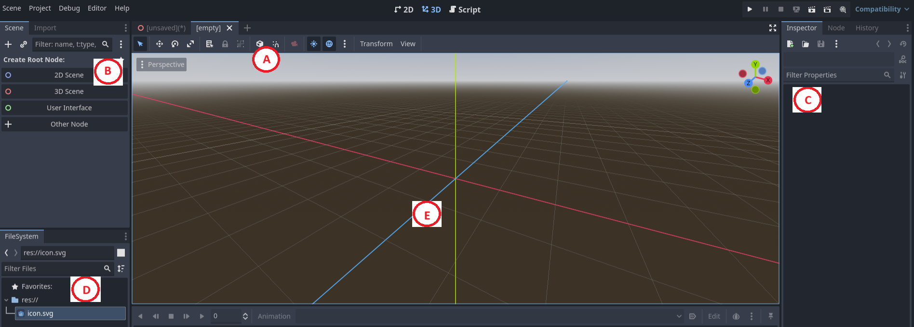
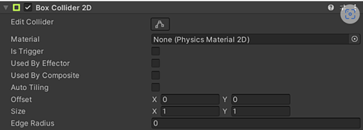
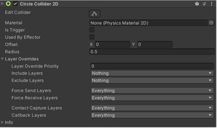

# Experience Scene Editor

## Introduction

Welcome to this sample user guide for a Game Scene Editor. This guide highlights essential features and tools that enable creators to design immersive game environments.

> **Note on Content and Privacy:**  
> This guide has been adapted from my work as a technical writer. Product names have been changed, screenshots removed, and sections merged to protect proprietary information. It demonstrates my writing style, technical structuring, and user-centric approach.

---

## Game Scene Editor

### Adding Assets

- The home page opens with the **Assets** tab activated.
- Click **My Assets**.
- Add a name and details for the asset.
- Browse and save the asset.
- The **Scene Manager** screen appears with a list of scenes.
- Select a scene or click **New Scene**.
- The **Game Scene Editor** screen opens with the **Scene** tab activated.

> *Placeholder image: Game Screen Editor from Godot*

Use the labeled sections below to navigate or follow the full walkthrough:

- **(A) Clipboard Toolbar** – Essential tools for editing scene objects.
- **(B) Asset Library** – Repository of all available assets.
- **(C) Explorer Window** – Hierarchical view of instances and parent-child relationships.
- **(D) Colliders and Properties** – Components that define object behavior.
- **(E) Scene View** – Real-time workspace for visualizing and editing the game world.

> **Note:** This sample includes content only for (A) Clipboard and (D) Components.

---

## Working with the Clipboard

The clipboard toolbar contains essential tools for editing scene objects.

> *Placeholder image: Clipboard toolbar*

### Essential Tools
The following table provides an explanation for each clipboard tool and their respective function.

| Control | Shortcut Key | Action | Icon |
|---------|--------------|--------|------|
| Undo    | Ctrl/⌘ + Z  | Reverses the last change. |  |
| Redo    | Ctrl/⌘ + Y  | Restores the last undone action. |  |
| Duplicate | Ctrl/⌘ + D | Creates a copy of the selected object at the same hierarchy level. |  |
| Copy    | Ctrl/⌘ + C  | Copies the current selection to the clipboard. |  |
| Paste   | Ctrl/⌘ + V  | Pastes clipboard contents at the desired location. |  |
| Cut     | Ctrl/⌘ + X  | Cuts the current selection and saves it to the clipboard. |  |
| Group in a Parent | Ctrl/⌘ + G | Creates a parent object and nests selected objects under it. |  |
| Unparent | Ctrl/⌘ + U | Deletes the parent and moves children up one level in the hierarchy. |  |

---

## Components – Colliders

Colliders define the shape of an object for physical interaction.

### Primitive Colliders

- **Box Collider** – Cube-shaped, ideal for crates, floors, walls.
- **Sphere Collider** – Spherical, ideal for rolling objects like balls.

---

### Box Collider

> *Placeholder image: Box Collider from Unity*

| Property    | Description                                                                 |
|-------------|-----------------------------------------------------------------------------|
| Is Trigger  | Enables collider to act as a trigger for events.                           |
| Offset      | Sets the center position (x, y, z) of the collider.                        |
| Size        | Defines the collider size along each axis (x, y, z).                       |

> *Note: Descriptions reflect a portion of the placeholder image.*

---

### Sphere Collider

> *Placeholder image: Sphere Collider from Unity*

| Property    | Description                                                                 |
|-------------|-----------------------------------------------------------------------------|
| Is Trigger  | Enables collider to act as a trigger for events.                           |
| Centre      | Sets the center position (x, y, z) of the collider.                        |
| Radius      | Adjusts the collider’s radius. Shape cannot be flattened or stretched.     |

---

## Key Terms

| Term              | Definition                                                                 |
|-------------------|----------------------------------------------------------------------------|
| Asset Library     | Repository for objects, textures, and components used in scenes.           |
| Clipboard Toolbar | Tools for editing actions like copy, paste, undo, redo.                    |
| Collider          | Component that defines physical interaction shape.                         |
| Component         | Defines object behavior and functionality.                                 |
| Explorer Window   | Hierarchical menu showing object relationships in the scene.               |
